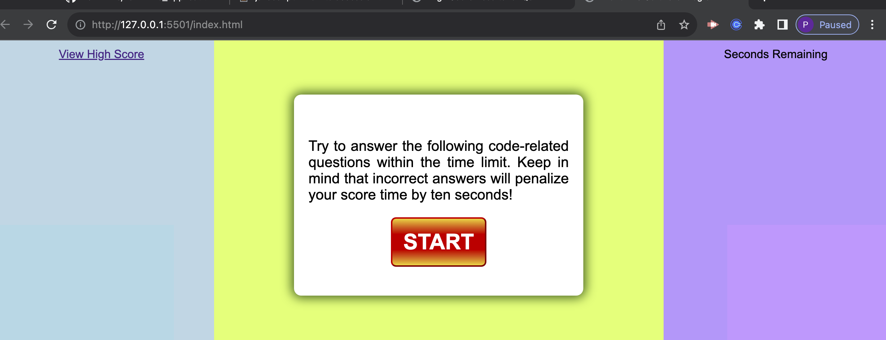
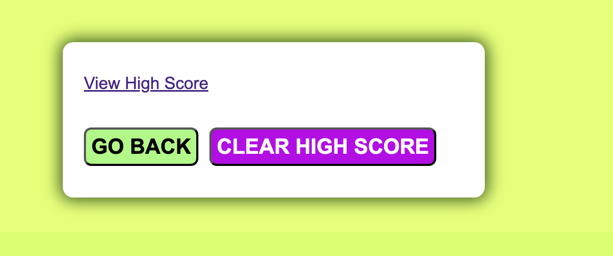
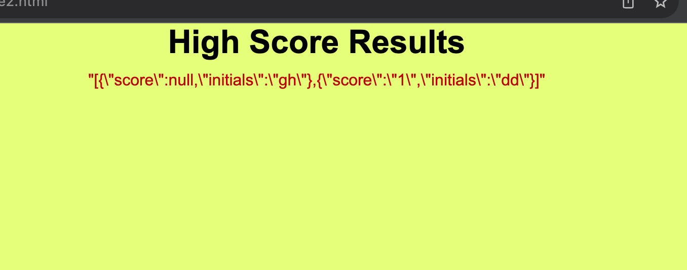

# Creating a Quiz for Employee Applicants

## Description

This project entails the use of multiple files of HTML and javascript, along with a CSS file

- It was required that I create a site that would take the job applicant thru a series of questions. The problems would be graded along the way in order to recieve a final grade. The applicant could then enter initials and either try again or enter for a final highscore rating. The highscore rating would be kept on the first page, so others could compete against that.
- It was built in order to learn how to push and pull information from the local server, in order to keep track of high scores. The problems were used in order to flip between questions and compared to achieve a point. ID's and classes were used in order to hide pages and make other pages appear. A timer was also incorporated to limit the time and take off time for wrong answers. When time ended, score was given.
- The application allows scores to be kept locally, without having to save everything to a server.
- Javascript methods were used to get and set information to and from the local Server. Script and href were used to navigat thru the two pages. If statements and for loops were used to analyze the events as the data was being entered.

## Usage

The quiz is begun by clicking the start button.

First question will start the timer on the right

when either time runs out or questions are finished
it will flip to panel to enter initials and reveal score

    hit enter and advance to next panel, this is where you can go back and try again or finish game.

    Also here is where you can view final High Scores, this can also be accessed from the first page on the left hand column

    when hitting results, I still have difficulty with the text for the results

## License

MIT License

Copyright (c) [2023] [Pam Willis]

Permission is hereby granted, free of charge, to any person obtaining a copy
of this software and associated documentation files (the "Software"), to deal
in the Software without restriction, including without limitation the rights
to use, copy, modify, merge, publish, distribute, sublicense, and/or sell
copies of the Software, and to permit persons to whom the Software is
furnished to do so, subject to the following conditions:

The above copyright notice and this permission notice shall be included in all
copies or substantial portions of the Software.

THE SOFTWARE IS PROVIDED "AS IS", WITHOUT WARRANTY OF ANY KIND, EXPRESS OR
IMPLIED, INCLUDING BUT NOT LIMITED TO THE WARRANTIES OF MERCHANTABILITY,
FITNESS FOR A PARTICULAR PURPOSE AND NONINFRINGEMENT. IN NO EVENT SHALL THE
AUTHORS OR COPYRIGHT HOLDERS BE LIABLE FOR ANY CLAIM, DAMAGES OR OTHER
LIABILITY, WHETHER IN AN ACTION OF CONTRACT, TORT OR OTHERWISE, ARISING FROM,
OUT OF OR IN CONNECTION WITH THE SOFTWARE OR THE USE OR OTHER DEALINGS IN THE
SOFTWARE..

## Credits

This video was referred to for educational purposes when initially setting up the quiz and running thru the questions. 
video:
Build A Quiz App With JavaScript
by Web Dev Simplified
https://youtu.be/riDzcEQbX6k

I was also givin assistants thru my tutor Juan Delgado. As well as help of understanding the process thru AskBCS Learning Assistant.